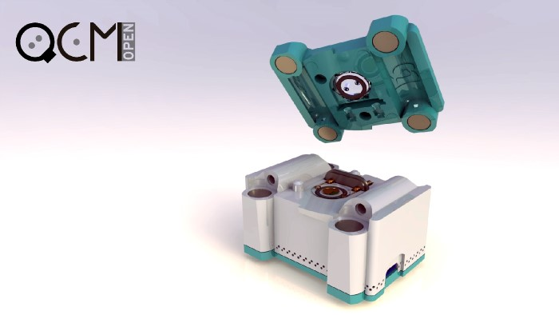

##Wet preparation equipment 

###Table of contents

- [Overview](000_bio-labware_overview.md)
- [General/wet preparation equipment](010_general_preparation.md)
  * [Fine Weighing Scale/ Microbalance](#Microbalance)
  * [Magnetic stirrer](#Magnetic-stirrer)
  * [Rotation wheel / tube rotator](#rotation-wheel)
  * [Centrifuge](#Centrifuge)
  * [Vortex mixer](#Vortex-mixer)
  * [Laboratory (orbital) shaker](#shaker)
  * [Lab jack](#Lab-jack)
  * [Microliter pipette](#Microliter-pipette)
  * [pH meter](#pH-meter)
  * [Ultrasonic bath](#Ultrasonic-bath)
  * [Heating plate / slide warmer](#heat-plate)
  * [Block heater (dry)](#heat-block)
  * [Fume hood](#fume-hood)
- [Microscopy](020_microscopy.md)
- [Spectroscopy](030_spectroscopy.md)
- [Chromatography (separation)](040_chromatography_sep.md)
- [Chromatography (detection)](050_chromatography_det.md)
- [Molecular Biology](060_molecular_biology.md)
- [Cell culture](070_cell_culture.md)
- [Electrophysiology](080_electrophysiology.md)
- [3D Bioprinting](090_3d_bioprint.md)
- [Various methods](100_various.md)

###Fine Weighing Scale/ Microbalance 

Source: http://sci-toys.com/scitoys/scitoys/mathematics/microgram_balance/

####1. Background
Precise weighing of chemicals in solution preparation, measuring small samples... Essential for any “wet” experiment, containing buffers and other solutions, which need to have a precise composition. Depending on the amounts of source material, the scales require the appropriate precision. For the average laboratory use, a precision of 0,001g or better is favorable.

Keywords: fine, weighing, gram, milli, micro, precision, scale, balance

####2. Commercial variants
The cheapest weighing scales with the appropriate precision, usually cost 100€ or more, higher quality devices around 300€. Scales capable of measuring differences in the microgram scope, can however also cost up to several 1000€ . On the other hand, devices with a 0,01g precision are already available for less than 20€.

####3. Available DIY resources
There are several fine weighing scale/microbalance projects on the internet. Most of them are easy to build, mechanical balances, such as [example 1](http://sci-toys.com/scitoys/scitoys/mathematics/microgram_balance/balance.html). While these can be precise, they are very impractical to work with, since they require balancing of samples against premade weights, which have discrete masses. There are far less DIY projects for digital scales, which could be due a relatively low necessity and the many factors, which can influence the precision and accuracy of such devices (balancing, temperature, nonlinearity...). There are still some available, such as [example 2](http://makezine.com/2008/03/25/diy-digital-balance/), with detailed [instructions](http://www.sci-spot.com/Mechanical/balance.htm), or [example 3](https://www.erowid.org/psychoactives/hardware/hardware_info1.shtml), [example 4](https://www.behance.net/gallery/8021801/Electronic-Weight-Scale-DIY-Kit). While all of these are capable of fine measurements, their precision and accuracy is questionable. An exception could be the [openQCM](http://openqcm.com/), suitable for submicrogram samples, which operates on the principle of measuring sample oscillation at high frequencies. It is fully open source, promises high precision and accuracy and offers support for Windows, Linux and Mac.

_"[Quartz Crystal Microbalance OpenQCM](http://openqcm.com/wp-content/uploads/2015/01/Quartz-Crystal-Microbalance-openQCM-open-1024x575.jpg)" by "[openQCM](http://openqcm.com/)" is licensed under [CC BY-NC-SA 4.0](http://creativecommons.org/licenses/by-nc-sa/4.0/)_

####4. Is DIY good enough and reasonable?
Whether it is reasonable to build your own weighing scale, strongly depends on the samples you are going to measure. For material in the range of 0.01g or more, low-cost scales are readily available. However, if you need higher precision, making your own could save you a fair amount of money. Fine DIY weighing scales already exist, their main problem, however, is reliability, which is critical.

####5. Requirements and plans
The favoured specifications of a lab grade weighing scale is simple use, a precision of 0.001g, on a range from 0.001 - 500g. Possible improvements are measurement recording (wifi/cable/...), and the possibility of inverse measurement with appropriate adapters for tensile testing.

---

###Magnetic stirrer 

Source: http://www.keison.co.uk/bibbyscientific_cr302.shtml

####1. Background
Magnetic stirrers are simple devices, used in combination with small magnetic rods, which are placed in a container and turned externally, to allow mixing of liquids and/or powdery materials. Usually, the top plate of a magnetic stirrer can also function as a heating plate.

Keywords: magnetic, stirrer, heating, plate

####2. Commercial variants
Typically magnetic stirrers cost from 100€ upwards, up to 1000€ for more advanced models with integrated heating plates. They are usually relatively bulky and require an external power supply, which makes them less suitable for stirring in non-standard conditions, like a refrigerator, incubator, in the field,...

####3. Available DIY resources
Since these are very simple to make using everyday objects, there is an overflow of DIY magnetic stirrer projects. In principle they are made from a electromotor with a magnetic top blade, a power supply and housing. [Example 1](http://www.instructables.com/id/How-to-DIY-your-own-Magnetic-Stirrer-V2-better-th/) is in principle, what most DIY projects look like. [Example 2](http://www.instructables.com/id/How-to-Make-a-Cheap-Portable-Magnetic-Stirrer/)is also portable, [example 3](https://github.com/pepaslabs/PCFanMagneticStirrer) has an adjustable rotation speed. Biohack academy's [BHA stirrer](https://github.com/BioHackAcademy/BHA_Stirrer) is the most sophisticated model up to date, with good adjustability, a stable housing and an integrated heating plate. Another, simple, yet seemingly well developed design is from [IOrodeo](http://public.iorodeo.com/docs/stir_plate/), which is also available as a kit for 120$.

####4. Is DIY good enough and reasonable?
Magnetic stirrers would definitely go in the category of equipment, where DIY is reasonable, or even beneficial. Commercial devices are unreasonably expensive and are limited to table-top applications. Existing DIY projects have done well to mimic the basic capabilities of commercial devices, for a fraction of the cost. More sophisticated devices also integrate a heating plate, can be portable, etc.

####5. Requirements and plans
Magnetic stirrers are cheap and easy to make, therefore we will try to establish our own model. The goal will be a stirrer, which is portable, yet can be connected to an external power supply. It should have an adjustable stirring speed (1-20Hz), which can, in addition to heating, possibly also be able to cool (0-100°C) and be controlled externally. It would be practical, to have one model without heating/cooling, which is compact and can be placed in climatized chambers (fridge, incubator).

---

###Rotation wheel / tube rotator 

Source: http://bmskgroup.com/product/mixers-rotators-tubes/

####1. Background
The rotation wheel is actualy a general preparation tool, but is often used for immunohistochemical preparation. Simply put, it is a slowly rotating wheel (0-1Hz), positioned at an (usually adjustable) angle. As a result, samples in small containers (eppendorf tubes, packages of blotting membranes with antibodies) attached to it are slowly stirred during the rotation.

Keywords: rotating, rotation, rotator, tube, wheel, mixer

####2. Commercial variants
Commercial rotation mixers usually cost several hundred €.

####3. Available DIY resources
Currently, there seem to be two DIY projects, which aim to make a good sample rotator. The [first design](http://www.teklalabs.org/sample-rotator/) is a rotating wheel from Teklalabs, suitable for rotating multiple falcons. The second one is a sample rotator from [NetFabb](http://3dprint.nih.gov/discover/3dpx-002349), that builds on a previous open-source device. It uses uses adjustable flaps, so samples can be rotated under different angles.

####4. Is DIY good enough and reasonable?
The expected requirements for sample rotators / rotating wheels are not very high, and both designs seem adequate for the desired purpose.

####5. Requirements and plans
Rotating wheels / sample rotators should be capable to slowly stir liquid samples in different small sized (up to 50ml) containers. They should allow the attachment of different container types, have an adjustable rotation angle and speed, which is still relatively slow (0-2Hz).

---

###Centrifuge 

Source: https://diybiology.files.wordpress.com/2012/06/gogofuge-img_2205.jpg?w=600&h=450&crop=1

####1. Background
Centrifuges are used for separation of substances in a liquid dispersion, depending on their differences in density. They are used in most “wet” experiments and are adapted for holding laboratory tubes, such as epis (eppendorf tubes), usually in sizes for 0,5, 1,5, or 2ml and falcons (conical centrifuge tubes), 15ml, 50ml,...
The most important thing to be noted when working with centrifuges, is to make sure they are well balanced. The high rotation speeds (4000 rpm and above), can create strong forces, causing an unbalanced centrifuge to break and even endanger their environment.

Keywords: centrifuge, micro, tubes

####2. Commercial variants
There are two basic types of commercial centrifuges, which are used either for epis or for falcons. The simplest types of both sizes begin at approximately 150€ and go into several hundreds. More sophisticated models also allow temperature adjustments (cooling) for delicate samples. Also, some integrate a vacuuming function, for rapid concentrating/drying of samples during centrifugation. These are substantially more expensive, costing several thousand euros.

####3. Available DIY resources
There are several designs available for DIY variants, using [PC fans](https://www.youtube.com/watch?v=eV-EGpJaOB8), [hard drives](https://www.youtube.com/watch?v=uqa1JNLLB78), [drills](http://www.popsci.com/diy/article/2013-07/how-build-your-own-diy-centrifuge), [blenders](http://citsci.blogspot.si/2009/11/centrifuge-revisited.html)..., however, much refinement is still possible in the design. Possibly the best two variants up to date are the [OpenFuge](http://www.instructables.com/id/OpenFuge/), which however costs about 180€ to make (the control board is readily available [here](https://www.tindie.com/products/CopabX/openfuge-control-board/)) and the [GoGoFuge](https://diybio.org/2012/06/12/gogofuge/), which is an improvement on the drill based dremelfuge.

####4. Is DIY good enough and reasonable?
For simple centrifugation (separating heavy particulate from a solution), precise control is not necessary, for which, a simple drill centrifuge (such as DremelFuge) would suffice. For more advanced purposes, typical for a laboratory, it would be advantageous to have control over the centrifugal force and rotation time. It would also be immensely useful, if one could upgrade the device to a vacuum concentrator without too much effort.

####5. Requirements and plans
As there are so many different DIY models available, we will set out, to test a few of them and plan to make an improved design, that will be cheap and meet the requirements of a wet laboratory. A laboratory centrifuge should have an adjustable rotation speed (0-7000 rpm) and time (0-60min). It should also be safe and stable.

---

###Vortex mixer 

Source: http://www.keison.co.uk/stuart_sa7.shtml

####1. Background
Opposed to centrifuges, vortex mixers are used to mix samples together, especially those in very small amounts. The construction of a vertical mixer is relatively simple, a small rubber cup (that holds the bottom of a sample vial) is fixed on a rotor slightly of center, so when the rotor is turning, the rubber is oscillating and thus creating a vortex inside the liquid containing vial.

Keywords: Vortex, mixer, vortexer

####2. Commercial variants
Typically, vortexers cost 150 - 250€ and allow adjustment of oscillation speed and are started by applying pressure on the rubber cup.

####3. Available DIY resources
While not many, there are exising and for the purpose good-enough DIY vortex mixers available, such as [example 1](https://www.youtube.com/watch?v=C-Tar7pmDWU) and [example 2](https://github.com/jdkizer/OS-Vortex-Mixer). The latter also has available plans for construction and is estimated to cost about 20€ when built at home.

####4. Is DIY good enough and reasonable?
For simple mixing, the existing DIY variants are absolutely sufficient and come for a fraction of the commercial cost. That said, there are still many possibilities to improve the device. It is beneficial, that the vortex is relatively heavy, to remain stable while rotating samples in an asymetrical manner. What commercial variants offer as a standard, is the regulation of the rotation speed and activation upon applied pressure to the cup.
What would improve the device even more, would be exchangable mounts (for example a flat table), which would add the functionality of shaking samples in different containers, a time counter and optional portability.

####5. Requirements and plans
A vortex mixer should have an adjustable rotation speed (0-20Hz), on a small oscillation radius (~1cm). An improvement would be, the rotation starting at applied pressure and a time counter (seconds).

---

###Laboratory (orbital) shaker 

Source: http://www.instrumentchoice.com.au/instrument-choice/lab-equipment/Mixers/medium-orbital-shaker-analogue-sceom5

####1. Background
A laboratory shaker is by operation very similar to the [vortex mixer](#Vortex-mixer), however, instead of a small sample holder, it has a larger surface, where multiple containers (flasks, beakers,...) can be placed and shaken. The shaking begins after turning the on switch and the rotation is substantially slower (0,1-5Hz) and has a wider radius, compared to the vortex mixer. The principle, however, is the same. Laboratory shakers, also orbital shakers, are devices used for even and slow stirring of liquid samples, often contained in glass utensils such as flasks, beakers, culture dishes. They are particularly usefull for gently suspending cell cultures/preventing sedimentation, without posing too much stress on the cells.

Keywords: laboratory, orbital, shaker

####2. Commercial variants
Commercial lab shakers cost a few hundred to a few thousand €.

####3. Available DIY resources
There are plenty resources on making DIY lab shakers, that come in different forms and even use different principles. A few of the designs include motion in only [one direction](http://www.instructables.com/id/Cheap-and-Easy-Lab-Agitator-Shaker-Great-for-PCBs-/), or [tilting movement](http://www.thingiverse.com/thing:5045) during the rotation, or simple orbital rotation, such as [here](http://splasho.com/blog/2014/04/08/openorbital-a-3d-printed-orbital-shaker/) with one motor, or [here](https://www.youmagine.com/designs/orbital-shaker).

####4. Is DIY good enough and reasonable?
The requirements for orbital shakers aren't very high, thus many of the DIY models seem good enough for most uses. Especially the 2nd and 3rd listed models seem to work very well.

####5. Requirements and plans
A laboratory shaker should have a stable platform, which allows the shaking of multiple containers, and an adjustable rotation mechanism (speed, possibly rotation radius). Optional is also a time counter, showing for how long the shaking has already taken place.

---

###Lab jack 

Source: http://www.thingiverse.com/thing:925556

####1. Background
A lab jack is an adjustable lifting stage, for elevating other tools in the laboratory, such as bottles, stirrers, etc.

Keywords: lab, laboratory, scissor, jack, stand, adjustable, platform, lifting, stage

####2. Commercial variants
Depending on the size, weight capacity and maximum elevation, lab jacks come at different prices. A small 10x10 cm platform with a working elevation of 5-15cm, that can carry somewhat above 10kg, costs 50€ or more.

####3. Available DIY resources
There aren’t many DIY designs available, but the existing ones are perfectly fine for general laboratory use. As they are made of printable plastic, their weight carrying capacity may not be as high as for their commercial steel counterparts, but this also isn’t necessary most of the time. Here are [example 1](http://www.thingiverse.com/thing:28298), which can be upgraded with a stepper motor and automated for fine adjustment, and [example 2](http://www.thingiverse.com/thing:925556), which is 100% printable.

####4. Is DIY good enough and reasonable?
This piece of equipment already seems to be as good as it gets in its DIY form, optimization doesn’t seem necessary.

---

###Microliter pipette 

Source: http://www.gilsonuk.com/catalogue/product/itemNo/F123784

####1. Background
Pipettes are lab tools, capable of transfering precise volumes of liquids from one container to another. In biological and biochemical work, automatic microliter pipettes are most widely used, due to their high precision and the the range of general sample size.

Keywords: microliter, pipette, automatic, adjustable

####2. Commercial variants
The average “wetlab” user requires at least 3 microliter pipettes, one for each range of 1-10μl, 10-100μl and 100-1000μl. A single, cheap pipette costs 50€ or more, typically 200-300€ for popular brands. They allow an accuracy and precision of 0.1-1μl. Most models of different brands use the same standard sized tips, which are consumables and can be acquired cheaply.
In recent years, more electronic pipettes are also being developed, with programmable pipetting, which are however appropriately expensive.

####3. Available DIY resources
There are two designs for DIY pipettes available at the moment, [the adjustable volume pipette](http://www.instructables.com/id/3D-Printable-Adjustable-Volume-Pipette/?ALLSTEPS), [Biropette](http://www.thingiverse.com/thing:255519), both are 3D printable to a large part. Both seem to handle pipetting well, however, precision and accuracy can still be improved.

####4. Is DIY good enough and reasonable?
The Biropette seems quite precise and acurate already, however, both can be improved, also a wider range of adjustability should be introduced, possibly in the 3 stages common for commercial devices.

####5. Plan
For laboratory use, we suggest commercial pipettes, however, we will work on a reliable, precise and accurate design, that will remain 3D printable to the most part.

---

###pH meter 

Source: http://www.wisegeek.org/what-is-the-ph-scale.htm

####1. Background
From all liquid analysis methods, pH-metry is probably the most widely used in biology and biochemistry. For preparational purposes, it is used for adjusting the pH of buffers and other solutions, which require specific properties, for biochemical reactions to take place.
Most commonly, the pH of a buffer, is adjusted by adding HCl or NaOH to a constantly stirred solution, while the pH value is measured.

Keywords: pH, meter, oxonium, hydrogen, ions, concentration

####2. Commercial variants
pH meters come in different forms, with various resolutions and accuracies. The cheapest variants are available for as little as 10€ (accuracy of pH 0,2), while lab-grade devices cost 300€ or more (accuracy of pH 0,01). The low-cost variants may just be sufficient for pools, or aquariums, they are probably not suitable for your laboratory. All devices require calibration solutions, which are used regularly and the process is all manual. A great chunk of the price is due to the quality of the sensor electrode.

While the devices contain sensing electrodes in the package, these can be bought separately and exchanged. They are available for 20-100€ and require care and maintenance to work properly.

####3. Available DIY resources
Many DIY projects can be found, ranging from those concentrating only on electronics, or complete devices, with various complexities and performances. In general, the devices are supposed to perform well, here are a few examples: The [Tiny pH meter](http://damien.douxchamps.net/elec/ph_meter/) is very accurate and has a good resolution, however, requires an additional (commercial/DIY) pH electrode. The same goes for the [simple pH meter](http://www.66pacific.com/ph/simplest_ph.aspx), which also shows good measurement performance and the [phduino](https://github.com/hephesto/phduino), which is an arduino based device. An example of a DIY system with a DIY electrode is found [here](http://www.instructables.com/id/cheap-DIY-electronic-pH-meter/?ALLSTEPS), the performance of the electrode itself is unknown. Similar instructions are found [here](https://noisebridge.net/wiki/BioBoard/Documentation/pH).

####4. Is DIY good enough and reasonable?
There are many DIY pH meters, which, at least with commercial electrodes, provide high quality measurements. The DIY electrodes on the other hand, would need to be tested in practice, to evaluate their performance. Nonetheless, even with commercial electrodes, pH meters leave a lot of room for improvement, especially for automation, long-time measurements,...

####5. Requirements and plans
The electronics will be assembled following the existing schematics, while experiments will be performed on the electrodes. Also, improvements for a wider applicability are planned. A pH meter should, with the assistance of calibration liquids, be capable of sensing the full pH range (1-14) of a solution, with a precision of 0,01.

---

###Ultrasonic bath 

Source: http://www.progensci.co.uk/page682/Laboratory-Equipment/Water-Baths/Ultrasonic-Baths/Clifton-Ultrasonic-Baths

####1. Background
Ultrasound baths are devices made for cleaning certain objects, such as jewlery, optical and surgical devices, etc. They have large transducer areas, which vibrate at ultrasonic frequencies (20-50kHz), that are transferred to a liquid and the contained samples and can break down brittle materials, but can also be used to degass liquids, mixing, etc.

Keywords: ultrasound, sonication, bath, cleaning

####2. Commercial variants
Commercial lab-grade ultrasonic baths, can cost from around 300, up to 1000€ for more sophisticated devices with heating.... They usualy contain a plastic basket, which protects the bath surface from damage, and have an adjustable sonication time, the frequency is however mostly fixed. Cheaper devices for the everyday consumer, with arguably the same performance, are however already available for 30-100€.

####3. Available DIY resources
There are a few DIY ultrasonic bath project plans available, [example 1](http://www.instructables.com/id/Home-Made-Ultrasonic-Cleaning-Tank/) and [example 2](http://archive.siliconchip.com.au/cms/A_112072/article.html), made from cooking pots. While these devices probably deliver satisfactory results, operatin at about 40kHz, same as the commercial devices.

####4. Is DIY good enough and reasonable?

It is questionable, whether it is reasonable to build a DIY ultrasound bath, since construction costs will be about the same as buying a cheap commercial device. This would probably depend on the experimental requirements, such as precise frequency, continer size and form,...

####5. Requirements and plans

For simple cleaning of glassware or utensils and degassing of liquids, cheap commercial devices are sufficient and would be our first choice, however, some experimentation on the DIY devices would be interesting, especially if these can be made cheaper, while more versatile. The important issue is the frequency (20-40kHz) and adjustable sonication time.

---

###Heating plate / slide warmer 

Source: http://www.pemed.com/lab/hotplates/hotplates.htm

####1. Background
When talking about heating plates in a laboratory, people usually have one of two possible associations: the heating top part of a magnetic stirrer or a slide warmer. In this section, we will be discussing the latter. While designed for warming and drying of microscope slides, these devices have other uses as well and come as a great addition for many a laboratory. In principle, they have a flat surface that is evenly heated to a temperature of 20-100°C, which can be precisely adjusted (1°C per step) and held constant.

Keywords: heating, plate, slide, warmer

####2. Commercial variants
Slide warmers are typically available for 300-500€, but smaller devices also come for less (approx. 200€).

####3. Available DIY resources
Slide warmers have not yet arrived in the DIY community. However, there seem to be a relatively simple hack for replicating them, which can be derived from DIY 3D printers. Using a heat-bed, which can evenly heat a plate to T above 100°C and only costs 20-30€, covered with a protective material (glass, aluminium) seems a good idea.

####4. Is DIY good enough and reasonable?
/

####5. Requirements and plans
As mentioned, for heating plates (slide warmers) it is important to evenly and precisely heat a surface, from room temperature to at least 100°C in steps of 1°C.

---

###Block heater (dry) 

Source: http://www.keison.co.uk/stuart_sbh130dsbh200d.shtml

####1. Background
Despite curious names, such as "block heater" or "dry bath", the functionality of these devices is actually very straightforward. They are used for heating of small containers (eppendorf tubes) inside an aluminium block (with appropriate holes) at certain constant temperatures. Often this is used to inhibit the activity of certain molecules, or to make others more susceptible to treatment.

Keywords: block, heater, dry, bath

####2. Commercial variants
New commercial block heaters cost around 1000€. While used ones are available for significantly less, they typically still come at 200€ or more.

####3. Available DIY resources
There are no DIY designs for block heaters by them selves, which is surprising, since they are actually used in [thermocyclers / PCR machines](060_molecular_biology.md#PCR), for which quite a few models are available. To read more, check out the [Molecular Biology](060_molecular_biology.md) chapter.

####4. Is DIY good enough and reasonable?
Considering the derived modules from the DIY thermocyclers, the DIY designs are both good enough and reasonable.

####5. Requirements and plans
The device should be able to set and hold an even temperature in the metallic (aluminium) block, ranging from room temperature to 100°C. Making heating and cooling fast, would also be beneficial, is however not obligatory. The blocks can be exchangable and adapted for different tube sizes.

---

###Fume hood 

Source: By Hey Paul from Sacramento, CA, USA - IMG_0071, CC BY 2.0, https://commons.wikimedia.org/w/index.php?curid=18244309

####1. Background
The fume hood is a chamber-exhaust system, used for work with dangerous, especially volatile compounds and is supposed to protect the user! It usually has one large opening, which allows relatively free arm and hand movement, and another opening which is connected to a ventilation system, to evenly draw air from the chamber. The inside of the hood is made from more or less inert materials, especially the bottom plate is mostly covered with laboratory ceramics. The air suction system has to be adjusted, to ensure, no gaseous substances can escape the chamber from the large opening. Additional internal lighting is also beneficial for larger systems. More about fume hoods and safe operation can be found [here](http://www.escoglobal.com/resources/pdf/guide-fumehoods.pdf).

Keywords: fume, hood, toxic, volatile, compounds, safety

####2. Commercial variants
Fume hoods come in different forms and sizes. Most common are probably the large chemical hoods, stretching from the floor to the ceiling, but smaller - benchtop devices are often used as well. The first type is substantially more expensive, costing several thousand €. The second type is cheaper, but can also cost well above 1k.

####3. Available DIY resources
For DIY, only table top designs are available, which are, however, fully sufficient for the average hobbyist. A few examples are shown [here](http://www.instructables.com/id/Building-a-small-fume-hood-for-stinky-projects/), [here](http://www.sciencemadness.org/talk/viewthread.php?tid=21508) or [here](http://hackaday.com/2013/11/30/over-powered-fume-hood-is-awesome/). These designs were made for "stinky" yet not very toxic and/or aggressive chemicals. This would pose a safety risk and require chemically resistant materials, such as glass, laboratory ceramics, stainless steel, etc. One such design is shown [here](https://www.youtube.com/watch?v=VshWeoiCw8E), it is, however, not well documented. On the other hand, the buildup is probably the same as in other projects, just using glass and steel for the exposed components. What is probably even more important than the materials themselves, is sufficient ventilation. Typical operation ranges from 60fpm (feet per minute, approximately 0.3m/s), to 100fpm (0.5m/s), which also depends on the size of the hood. Even suction has to be assured (high airflow velocities are actually disadvantageous), without creating large turbulences, which could let fumes from the inside escape towards the user. Luckily, new kitchen hoods are perfectly capable of sustaining such airflows, and perhaps only require an exchange of the outer coverings and filters with inert ones.

####4. Is DIY good enough and reasonable?
It is currently difficult to comment on the state of DIY fume hoods, as little, to no quantitative tests were done on the performance and safety of the DIY devices. Considering only the technical data, however, a "good enough" DIY fume hood system should be achievable, provided that a safe exhaustion can be installed.

####5. Requirements and plans
As mentioned above, fume hoods for work with dangerous chemicals, shoud be constructed from inert materials and sustain suitable air flow, to protect the user.
